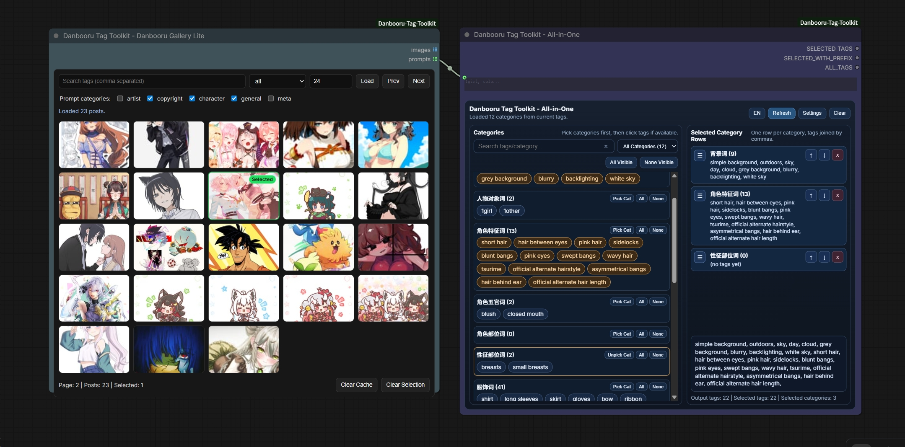
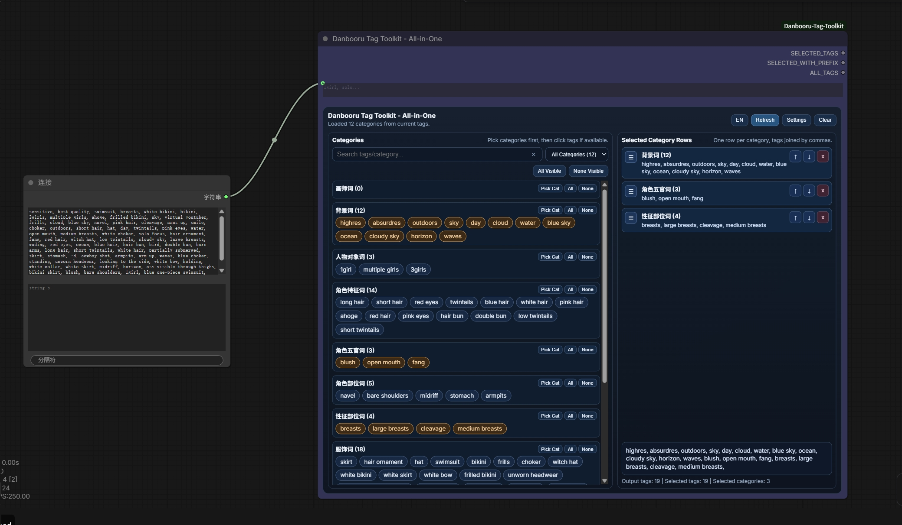

# ComfyUI-Danbooru-Tag-Toolkit

Danbooru tag workflow tools for ComfyUI.

## Highlights

- All-in-one Danbooru tag sorting + visual selection
- Lightweight Danbooru gallery node (image + prompt list output)
- Flexible category mapping and output order from Excel/CSV database
- Works with both direct input tags and linked upstream prompt sources

## Screenshots

### All-in-One + Gallery Workflow



### Node UI in ComfyUI



## Example Workflow

- JSON workflow file: [`example/example_worlflow.json`](example/example_worlflow.json)

## Included Nodes

- `Danbooru Tag Toolkit - All-in-One` (`DanbooruTagSorterSelectorNode`)
  - Outputs: `SELECTED_TAGS`, `SELECTED_WITH_PREFIX`, `ALL_TAGS`

- `Danbooru Tag Toolkit - Danbooru Gallery Lite` (`DanbooruTagGalleryLiteNode`)
  - Outputs: `images` (list), `prompts` (list)

## Installation

1. Clone or copy this repo into ComfyUI `custom_nodes`.
2. Install dependencies:

```bash
pip install -r requirements.txt
```

3. Restart ComfyUI.

## Quick Start

1. Add `Danbooru Tag Toolkit - Danbooru Gallery Lite`.
2. Search and select one or multiple posts in gallery.
3. Connect gallery prompt output to `Danbooru Tag Toolkit - All-in-One` `tags` input.
4. Click `Refresh` in All-in-One to preview categories from current selection.
5. Select category rows/tags and use final text outputs.

## Tag Database

Default file:

- `tags_database/danbooru_tags.xlsx`

Required columns:

- `english`
- `category`
- `subcategory`

You can use custom `.xlsx`/`.csv` by setting `excel_file` in node settings.

## Configuration

- `defaults_config.json`
  - `mapping`: default category mapping
  - `order`: default category output order

## License

MIT. See `LICENSE`.
